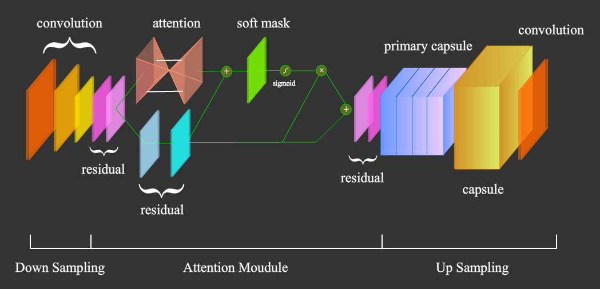
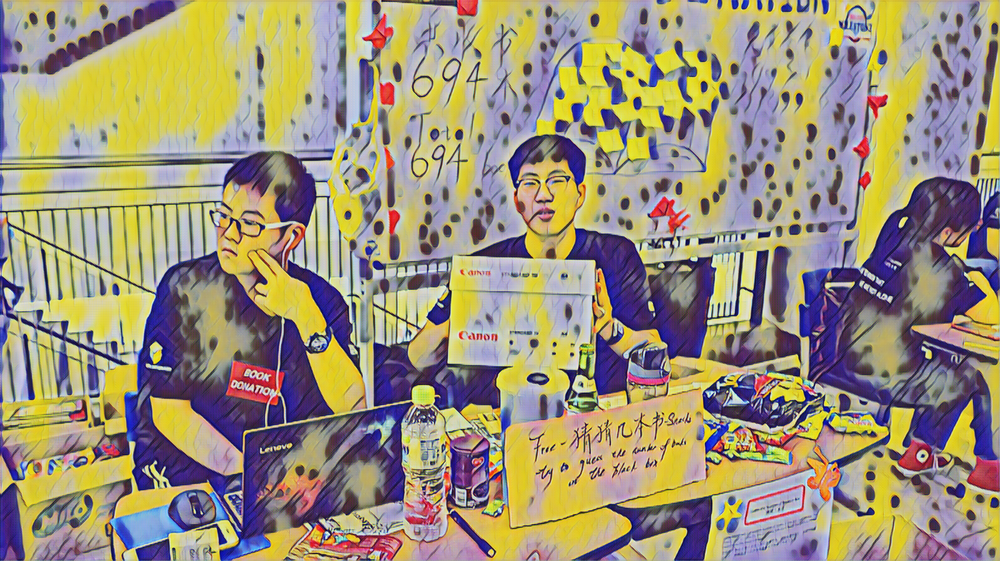

# Perceptual-Losses---Style-Transfer---Attention-Capsule-Network
Perceptual Losses - Style Transfer - Attention Capsule Network

This project is a school assignment, we refer to attention53 and the capsule network to construct a new feedforward neural network to reproduce the style transfer method proposed in the 2016 ECCV paper "Perceptual Losses for Real-Time Style Transfer and Super-Resolution", and the new effect can highlight the significant features.
For more details, please download the report.
For more codes, you can access [my google drive](https://drive.google.com/open?id=1CbY5-lACB-DyZJtiQv6WRlkgkjZBrC8e).

# References
1. [“A Neural Algorithm of Artistic Style”](https://arxiv.org/pdf/1508.06576.pdf)
2. [“Dynamic Routing Between Capsules”](https://arxiv.org/abs/1710.09829)
3. ["Fixing Weight Decay Regularization in Adam"](https://arxiv.org/abs/1711.05101)
4. [“Instance Normalization: The Missing Ingredient for Fast Stylization”](https://arxiv.org/abs/1607.08022)
5. [“Perceptual Losses for Real-Time Style Transfer and Super-Resolution”](https://arxiv.org/abs/1603.08155)
6. [“Residual Attention Network for Image Classification”](https://arxiv.org/pdf/1704.06904.pdf)
7. [“Squeeze-and-Excitation Networks”](https://arxiv.org/abs/1709.01507)
8. [Pytorch implementation of Fast Style Transfer](https://github.com/eveningglow/fast-style-transfer-pytorch)
# Our Model

# Result
Original Picture

2016 Paper

Ours

Other results


# How to use it？
Upload demo.ipynb to colab, and then run the ceils you need.
```
# train
s = Solver(trn_dir = '../Perceptual/pytorch_v/data',
           style_path = 'style/abs.jpg', 
           record_name = 'abstract_1_caps_record',
           result_dir = 'check', 
           weight_dir = './',
           num_epoch = 3,
           batch_size = 5,
           content_loss_pos = 1,
           lr = 1e-3,
           lambda_c = 1,
           lambda_s = 5e4, #5e4 1e6
           show_every = 20,
           save_every = 5000,
           pretrain = None,
           lossNet = 'vgg', # vgg senet50， 
           process_dir = 'process', 
           process_image = 'content/ybh.jpg', 
           process_scale = 0.3, 
           process_number  = 20, 
           record_number = 600,
           test_dir = '../Perceptual/pytorch_v/valid',
           test_number = 5,
           transNet = 'capsnet', # capsnet cnn
           opti = 'adamw', # adam adamw sgd
           norm_type = 'instance', # batch instance
           gram = 'gram' # gram gramP(Double Gram)
          )

s.train()

# test
content_name = 'tp.jpg'
test(
    weight_path='new_weight/udnie.weight' ,
    content_path='content/' + content_name, 
    output_path='fantasy_' + content_name.split('.')[0] + '.png',
    scale=0.9,
    transNet='capsnet',
    norm_type='instance', # batch instance
)
```
